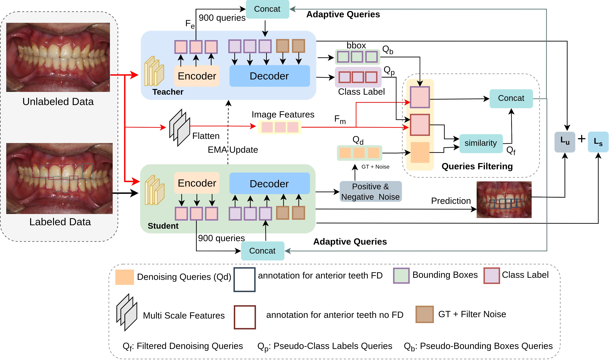
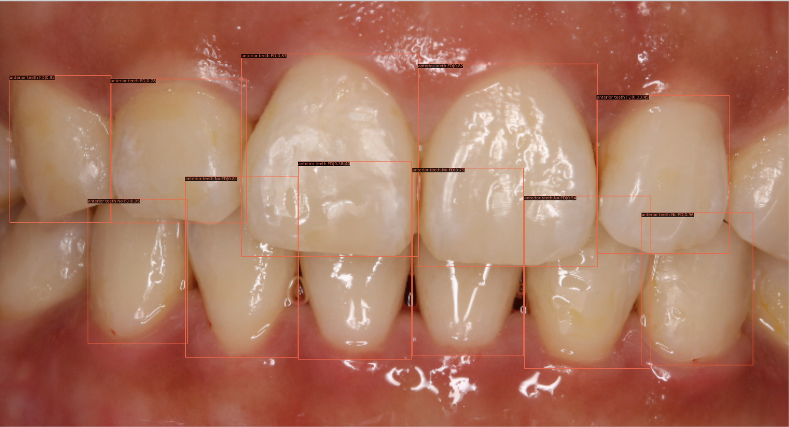

# FD-SSD
[](https://example.com/your-paper-link)
[](https://github.com/tahirashehzadi/FS-SSD/issues)
[](https://github.com/tahirashehzadi/FS-SSD/blob/main/LICENSE)
<div style="text-align: center;">
    
</div>

## Getting Started
### Table of Content
- [Installation](#installation)
- [Data Preparation](#data-preparation)
- [Training](#training)
- [Evaluation](#evaluation)
- [Results](#results)
- [Example](#example)
### Installation
1. Clone the repository:
    ```sh
    git clone https://github.com/tahirashehzadi/FD-SSD.git
    cd FD-SSD
    ```

2. Create a virtual environment:
    ```sh
    conda create -n FD-SSD python=3.8
    conda activate FD-SSD

     ```

3. Install PyTorch:
    ```sh
    conda install pytorch==1.9.0 torchvision==0.10.0 torchtext==0.10.0 cudatoolkit=10.2 -c pytorch
    ```
    
4. Please install mmdet in editable mode first:
     ```sh
    cd thirdparty/mmdetection && python -m pip install -e .
     ```
        
4. Building on mmdetection, we have developed a detection transformer module (detr_od) and a semi-supervised module (detr_ssod) in a similar manner. 
  These modules need to be installed first. Ensure you update the module names (detr_od and detr_ssod) in the setup.py file if necessary.
     ```sh
    cd ../../ && python -m pip install -e  .
     ```
         
6.This process will install mmdet, detr_od, and detr_ssod in the environment. Additionally, you need to compile the CUDA operations required for deformable attention:
  ```sh
   cd detr_od/models/utils/ops
   python setup.py build install
  ```

### Data Preparation
Download the [FDTOOTH]( https://drive.google.com/uc?id=1Xm794_tzCh1TtIfJYJLFlmv013GTL_Uh) dataset.
  ```sh
/FDTOOTH/data/v1/
    ├── images_all/
    └── annotations/
    ├── 90_FD_train.json
    ├── 40_FD_test.json
    └── 20_FD_val.json
  ```


### Training

- To train the model in a fully supervised setting:
    ```sh
    sh tools/dist_train_detr_od.sh dino_detr ${GPUS}
    ```
- As an example, to train the model in a fully supervised setting with 2 GPUs, you would use the following command:
    ```sh
    sh tools/dist_train_detr_od.sh dino_detr 2
    ```
- To train the model with semi-supervised data:
    ```sh
    sh tools/dist_train_detr_ssod.sh dino_detr_ssod ${FOLD} ${PERCENT} ${GPUS}
    ```
- For instance, you can execute the following script to train our model using 10% labeled data with 2 GPUs on the first split:
    ```sh
    sh tools/dist_train_detr_ssod.sh dino_detr_ssod 1 10 2
    ```
### Evaluation
- To evaluate the model: 
    ```sh
    python tools/test.py <CONFIG_FILE_PATH> <CHECKPOINT_PATH> --eval bbox
    ```  

- For example, to evaluate the model in a semi-supervised setting: 
    ```sh
    python tools/test.py configs/detr_ssod/detr_ssod_dino_detr_r50_coco_120k.py \
    work_dirs_fan_table_Publaynet_Table_10/detr_ssod_dino_detr_r50_coco_120k/10/1/epoch_12.pth --eval bbox
    ```
We provide detailed results and models trained by us bellow:

### Results
| Label (%) | mAP  | AP50 | AP75 | APFD | F1   | Pth files |
|-----------|------|------|------|------|------|-----------|
| 5%        | 40.5 | 44.8 | 43.2 | 42.5 | 0.53 |[CKPT](https://drive.google.com/drive/folders/1dnZ010Yo-Xix1Pd56beTPaIfopSpUfVb?usp=drive_link) |
| 10%       | 49.9 | 55.6 | 52.2 | 45.7 | 0.64 |[CKPT](https://drive.google.com/drive/folders/1dnZ010Yo-Xix1Pd56beTPaIfopSpUfVb?usp=drive_link) |
| 50%       | 55.0 | 59.7 | 56.5 | 50.3 | 0.69 |[CKPT](https://drive.google.com/drive/folders/1dnZ010Yo-Xix1Pd56beTPaIfopSpUfVb?usp=drive_link) |


We provide detailed results and model weights for reproducibility and further research.

| Method                           | Multi-task | Approach         | APFD  | mAP   | AP50  | AP75  |
|----------------------------------|------------|------------------|-------|-------|-------|-------|
| **Object Detectors⋆**           |            |                  |       |       |       |       |
| Diffusion-DETR w/o pretraining  | ✗        | Supervised       | 1.31  | 1.7   | 8.85  | 0.04  |
| Diffusion-DETR                  | ✗          | Supervised       | 51.42 | 59.06 | 66.37 | 62.58 |
| DDETR                           | ✗          | Supervised       | 50.41 | 57.44 | 65.48 | 62.68 |
| DINO                            | ✗          | Supervised       | 49.68 | 51.65 | 57.65 | 55.13 |
| Hierarchical-Diff-DetR w/o pretraining  | ✓  | Supervised | 0.00  | 0.00  | 0.00  | 0.00  |
| Hierarchical-Diff-DetR          | ✓          | Supervised       | 50.82 | 57.63 | 64.40 | 61.45 |
| DDETR                           | ✓          | Supervised       | 47.57 | 54.89 | 63.05 | 60.20 |
| DINO                            | ✓          | Supervised       | 43.85 | 50.15 | 55.53 | 53.80 |
| SparseDet                       | ✓          | Supervised       | 52.94 | 54.87 | 65.13 | 62.96 |
| **Open-set Object Detectors†**  |            |                  |       |       |       |       |
| GLIP                            | ✗          | Supervised       | 32.00 | 40.47 | 55.85 | 51.30 |
| GDINO                           | ✗          | Supervised       | 56.59 | 62.59 | 65.89 | 63.69 |
| GLIP                            | ✓          | Supervised       | 38.68 | 42.73 | 51.97 | 56.70 |
| GDINO                           | ✓          | Supervised       | 54.75 | 62.08 | 65.81 | 62.60 |
| FD-SOS                          | ✓          | Supervised       | 60.84 | 65.97 | 69.67 | 67.07 |
| **FD-SSD (Ours)**               | ✓          | Semi-Supervised  | **64.5** | **68.3** | **73.2** | **70.7** |

#### *requires pre-training on public dental dataset after initialization from ImageNet pre-trained weights.
#### † refers to fine-tuning existing VLM pre-trained models.
### Example

<p align="center">
  
  
</p>


### Acknowledgment


